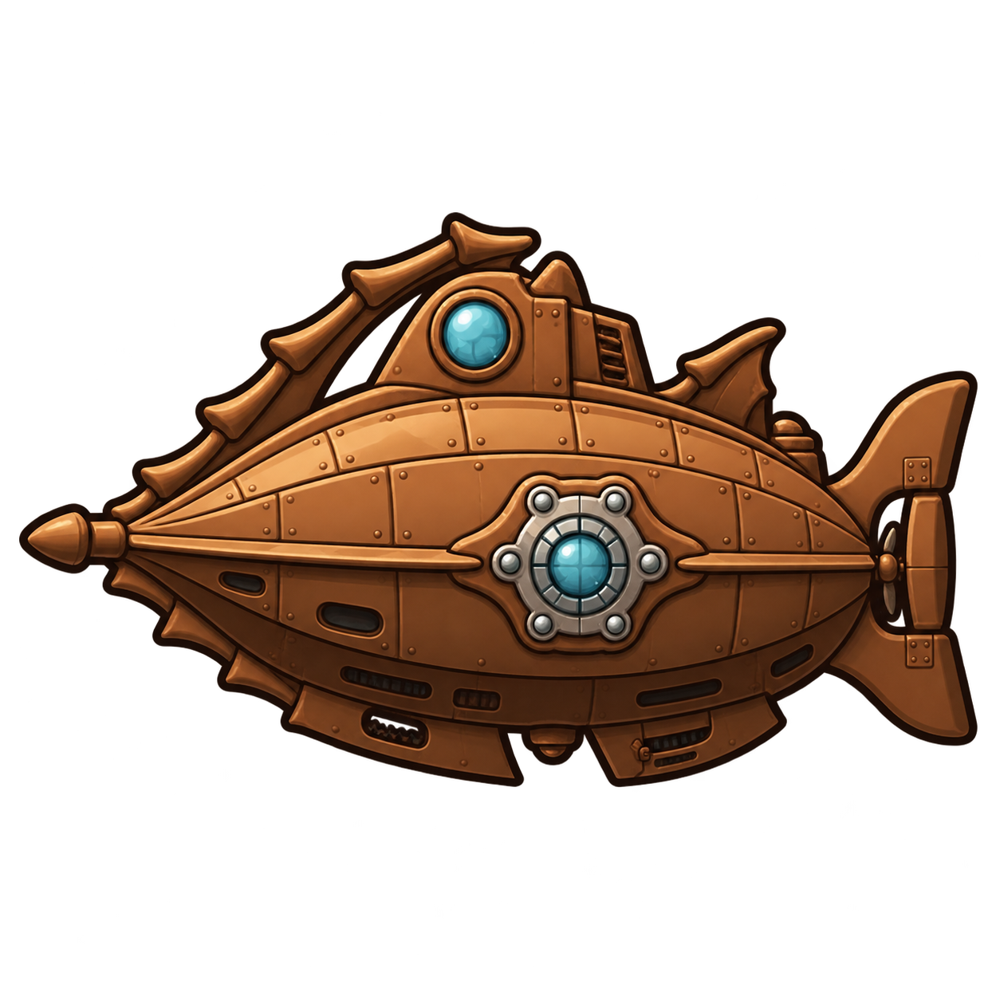
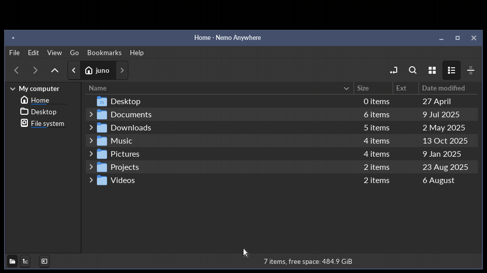
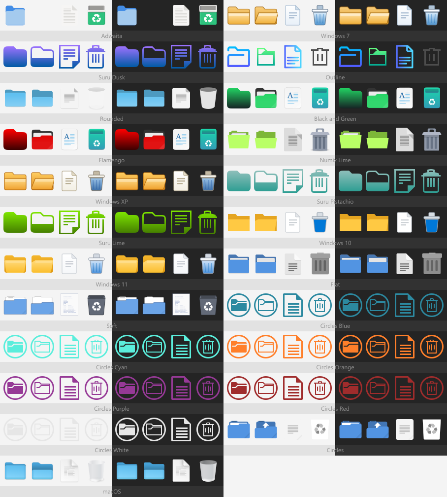

<!-- markdownlint-disable MD007 -- Unordered list indentation -->
<!-- markdownlint-disable MD010 -- No hard tabs -->
<!-- markdownlint-disable MD033 -- No inline html -->
<!-- markdownlint-disable MD055 -- Table pipe style [Expected: leading_and_trailing; Actual: leading_only; Missing trailing pipe] -->
<!-- markdownlint-disable MD041 -- First line in a file should be a top-level heading -->

<!--

-->

<!-- TOC ignore:true -->
# nemo-anywhere

<table style="border: none; border-collapse: collapse;">
	<tr style="border: none; border-collapse: collapse;">
		<td style="border: none; border-collapse: collapse;"></td>
		<td style="border: none;">The legendary Nemo file manager, ported to Windows, with BSD and macOS to follow - as well as to Linux without the Cinnamon dependency. Also with several major new convenience features.</td>
	</tr>
</table>

<!-- TOC ignore:true -->
## Table of contents

<!-- TOC -->

- [Why](#why)
- [Existing features](#existing-features)
- [What this fork adds or improves](#what-this-fork-adds-or-improves)
- [Status](#status)
- [Icon themes](#icon-themes)
- [Installation](#installation)
	- [Packages and installers](#packages-and-installers)
	- [Direct stable and dev install scripts](#direct-stable-and-dev-install-scripts)
	- [DIY](#diy)
- [Set up development environment](#set-up-development-environment)
- [Longer-term roadmap](#longer-term-roadmap)
- [Copyright and license](#copyright-and-license)

<!-- /TOC -->

## Why

Nemo is one of the best file managers going. Fast, sane, powerful.

There's just one catch. It's part of the Linux Cinnamon desktop.

This project removes the Cinnamon (and even Linux) dependency:

- It takes Nemo as-is, from the source.

- Removes every assumption that says "you are running Cinnamon" or even "you are running Linux".

- Removes the heavy desktop integration. Your existing manager is untouched - which can even be original Nemo, they don't conflict. (This is also a big step toward OS portability.)

- Shippable everywhere. (At least, desktop OSes.)

That means, in order:

- **Linux**:
	- Standalone on any desktop.

	- No Cinnamon dependencies. No Cinnamon, no xapp, no desktop stack pulled in behind it.

	- Doesn't try to compete with existing desktop managers for control of desktop rendering. (A real pain point with OG Nemo.)

- **Windows**: A real native build, not a compatibility shim.

- **BSD**

- **macOS**: Later. Nothing in the code should stand in the way, but it hasn't been tried yet.

One codebase. "For Windows" and friends are just labels on builds, not separate projects.

It is opinionated. It manages files and folders. It does more of the file management you need, built in, on every platform, so nothing depends on third-party programs, plugins or extensions that only exist on one of them.

This is an independent, unofficial hard fork of [linuxmint/nemo](https://github.com/linuxmint/nemo), taken at the 6.6.4 release. It is not affiliated with, endorsed by, or supported by Linux Mint, the Cinnamon team, or GNOME.

Report issues here, never upstream. Provenance details live in [fork.md](fork.md).

## Existing features

Everything that makes Nemo worth porting:

- Fast, no-nonsense navigation. Back, forward, up, refresh, breadcrumbs or a path box - your pick.

- Real file operation progress. See what is happening, and how far along it is.

- Folder contents merging is intuitive. No more accidental clobbering.

- Open in terminal, built in.

- Proper bookmarks.

- Copies use near-instant and near-zero-size CoW copies automatically, if the underlying filesystem allows it.

## What this fork adds or improves

- Runs without Cinnamon. No desktop-drawing baggage, no pulled-in desktop stack.

- Runs without Linux. Windows is a real native build, not a compatibility layer. BSD and macOS come after.

- On Windows it is one executable. The whole runtime is packed inside it, so there is nothing to install and nothing to keep in step. Copy it where you like and run it.
	- Same idea as an AppImage or a Flatpak, without the runtime or the sandbox.
	- On Linux it stays a small folder that uses the GTK3 your distro already has, because that is what a Linux user expects and it keeps the download tiny.

- On Windows it fits in, without pretending to be Explorer:
	- The Recycle Bin can be browsed, restored from and emptied.
	- Alt+Enter opens the same Properties sheet Explorer shows, tabs from other programs included.
	- `.lnk` shortcuts can be made, edited and opened the way Explorer opens them. Shortcuts, symlinks and junctions each get their own overlay, so they are easy to tell apart.
	- Each fixed drive sits in the sidebar with a usage bar.
	- Dot files and files with the hidden attribute each have a switch. Ctrl+H flips both.
	- Open in Windows Terminal, Open as Administrator, Open with Explorer, and Copy path with either kind of slash.
	- Light or dark follows the Windows setting. Four icon sets are drawn to match XP, 7, 10 and 11.
	- It draws at each monitor's own scale instead of being stretched.
	- File associations are read from the registry and never written to it. "Set as default" keeps its choice in the settings file.
	- The Windows search index can be used for faster searches. It is off by default, since it only knows the folders it was told to watch.

- Every instance is its own process. If one crashes for some reason, the rest keep going.
	- A crash leaves a report beside the settings file, so there is something to send in.

- Integrated - and more advanced - archive handling. No more third-party GUI application dependencies that don't feel integrated, don't support the archive format's best options, etc.
	- Right-click Compress writes zip, tar and 7z by itself, with a password, split volumes, and a cap on how much of the CPU it takes. rar, and the 7z options the built-in writer lacks, are used when those programs are installed.
	- Right-click Extract reads most archive types, with real progress and a question when a file already exists. An archive can't write outside the folder it is unpacked into.
	- Compress can delete the originals afterward, off by default. It reads the finished archive back first and checks every file is in it at the right size, and even then the originals go to the trash.

- A drag that moves files says what it is about to do first. One of the easiest ways to lose track of a file in any graphical file manager is a drag nobody meant to start, and by the time it is noticed the folder it went to is anyone's guess. Copies and links go through without a word unless you ask for those too.

- A large delete, or one generated with no user input, prompts even with confirmation turned off.

- Trash and delete operations record what they did: how many items, which folder, the first name in the batch, and what set it off.

- Links are never followed on a delete or a move. Only the link goes. Copying a link asks whether to keep it a link or copy what it points to.

- Make link asks what to make: a symlink, a hardlink, a Windows shortcut, or on Windows a junction, with a relative or an absolute path. A shortcut made on Linux opens in Nemo Anywhere anywhere, though not in Explorer.

- Windows `.lnk` shortcuts work on Linux too. One to a folder goes to that folder, one to a file opens the file, and each shows its target's icon. The Windows path inside is matched to a drive or share this machine has mounted. When there is no sure match it says so instead of guessing.

- Only a window can trash, delete or move files. Another program on the session bus can't, which Nemo's old desktop interface allowed.

- List view columns size themselves to what is in them. Name and Location share whatever room is left, dates and permissions keep a fixed width, and the view scrolls sideways before it squeezes a column too small to read. An Ext column sits next to Name.

- Alternate rows can be shaded, off by default. Selection and hover still show through it.

- Places and the folder tree can be open side by side, each at its own width. The tree lists folders only, and a folder with nothing under it gets no expander.

- Tabs are as wide as their title. With full paths on, a path too long to fit is shortened a step at a time, and the name of the folder itself is always kept.

- Every folder follows one set of view defaults, unless per-folder settings are turned on.

- Search results can be grouped under the folder they came from. A flat list of thirty files all called `notes.txt` tells you nothing; a row per folder with the matches under it tells you where to look. One toggle in the search bar, and the same results either way.

- Content search reads Word, Excel, PowerPoint, OpenDocument and EPUB files by itself. No helper scripts and no office suite.

- The thumbnail cache is cleaned up once in a while, rather than growing forever.

- A folder of pictures has all its thumbnails made as soon as it opens, top down, not only the ones scrolled to. Photoshop and camera raw files get thumbnails too, and with ImageMagick installed so do JPEG 2000, HEIC, EXR and the other picture formats it reads.

- Settings live in one plain text file you can read and edit. No registry, no dconf, no compiled schema. Editing it by hand does the same thing as changing the setting in the dialog.

- Copy, paste and drag work with the platform's own file manager, in both directions.

- What a platform cannot do is hidden or grayed out rather than failing when clicked. No "Make Link" on Windows, no permissions tab where there are no permissions.

- Releases can be checked. Each one is reproducible from the commit it was built at, and published with checksums.

- Dozens of "minor papercut" fixes, and "quality-of-life" improvements.

## Status

Beta, but only while the visual polish gets its last pass. It is stable and safe for everyday use on Linux and Windows, and has been in daily use for months.

Every build goes through static analysis, the full regression suite, and the checks that guard against losing files. A full pipeline run adds fuzzing and a performance profile.

Rough edges to know about:

- For now every trash and delete asks first, in a plain dialog that says exactly what is about to go and why. It is an extra safety net for the beta, and goes back to the normal confirmations before the stable release.

- The Windows exe is not code-signed yet, so Windows may warn the first time it runs.

- Settings from a pre-1.0 install do not carry over.

- macOS and BSD are not built yet.

Details:

- Plans and progress: [project/backlog.md](project/backlog.md)

- Design and reasoning: [project/design.md](project/design.md)

- Code style: [project/style-guide_code.md](project/style-guide_code.md)

- UI style: [project/style-guide_ui.md](project/style-guide_ui.md)

## Icon themes

Twenty-three icon sets ship inside the application - light and dark, and no download. Pick one in **Preferences -> Appearance**; the Style picker moves the Icons picker to match, so a Windows 11 window frame does not come with macOS icons unless you ask for it.

Each set is shown twice, on a light background and a dark one, because half of them are drawn for a dark desktop. The four Windows looks - XP, 7, 10 and 11 - are drawn in-house: no cleanly-licensed set of any of them exists, and every set that circulates draws blue folders, which Windows has never had. The rest are trimmed to the roughly 180 names a file manager actually asks for, which is what holds a set to a few hundred kilobytes; anything not drawn falls through to Adwaita.

Provenance and license for every vendored set is in [vendor/README.md](vendor/README.md).

### Adding your own

Drop a theme folder into the icons directory beside your settings file and it appears in the picker next launch - `~/.config/nemo-anywhere/icons/` on Linux and BSD, `%APPDATA%\nemo-anywhere\icons\` on Windows, `~/Library/Application Support/nemo-anywhere/icons/` on macOS. Widget themes work the same way in `themes/` beside it. Both folders are created empty on first run.

[filesystem/README.md](filesystem/README.md) covers the layout, the two optional `index.theme` keys that tell the picker which modes a theme suits, and one-line fetch commands for Buuf - a set worth having that cannot be bundled, because its NonCommercial license rules it out of anything shipped.

## Installation

Everything is on the [releases page](https://github.com/yottacore/nemo-anywhere/releases). Pick whichever of the three below suits you. Building from source is for working on it, not for using it.

### Packages and installers

- **Windows**: download `nemo-anywhere.exe` and run it. That is the whole program - the runtime is inside it. Nothing is installed and nothing is registered.

- **Debian, Ubuntu, Mint**: `sudo apt install ./nemo-anywhere-<version>-linux-x86_64.deb`

- **Fedora, openSUSE, RHEL**: `sudo dnf install ./nemo-anywhere-<version>-linux-x86_64.rpm`

Both packages install to `/opt/nemo-anywhere` with a menu entry and `nemo-anywhere` on PATH, and use the GTK3 your distro already provides.

### Direct stable and dev install scripts

One command. It downloads the right build for the machine, verifies its checksum, tells you exactly what it is about to do, and waits for a yes. The defaults suit most people. Add `--help` (`-Help` in PowerShell) to see the options.

Linux, BSD, macOS, WSL:

~~~bash
bash <(curl -fsSL https://raw.githubusercontent.com/yottacore/nemo-anywhere/main/install.bash)
~~~

Windows, or anywhere else with PowerShell. It is a full installer on its own, not a wrapper around the one above:

~~~powershell
& ([scriptblock]::Create((irm 'https://raw.githubusercontent.com/yottacore/nemo-anywhere/main/install.ps1')))
~~~

Add `--uninstall` (or `-Uninstall`) to reverse it. Reinstalling over an existing copy is fine - it replaces it.

Where it goes:

| OS      | User install (default)                 | Launcher                                                  | (or) System install             | Launcher
| :---    | :---                                   | :---                                                      | :---                            | :---
| Linux   | ~/.local/share/nemo-anywhere/          | ~/.local/share/applications/ + ~/.local/bin/nemo-anywhere | /opt/nemo-anywhere/             | /usr/local/share/applications/ + /usr/local/bin/nemo-anywhere
| BSD     | ~/.local/share/nemo-anywhere/          | ~/.local/share/applications/ + ~/.local/bin/nemo-anywhere | /usr/local/nemo-anywhere/       | /usr/local/share/applications/ + /usr/local/bin/nemo-anywhere
| Windows | %LOCALAPPDATA%\Programs\Nemo Anywhere\ | Start Menu shortcut + a PATH entry                        | C:\Program Files\Nemo Anywhere\ | Start Menu shortcut + a PATH entry
| macOS   | *pending a macOS build*                |                                                           |                                 |

Settings live where each platform puts them - `~/.config/nemo-anywhere` on Linux and BSD, `%APPDATA%\nemo-anywhere` on Windows, `~/Library/Application Support/nemo-anywhere` on macOS - and are left alone by an uninstall.

### DIY

Unpack `nemo-anywhere-<version>-linux-x86_64.tar.gz` wherever you like and run `bin/nemo-anywhere` from inside it. It is relocatable, so no fixed path is required. Verify the download against the `sha256sums.txt` file published beside it.

What a Linux build needs at runtime: GTK 3.24.33 or newer and glibc 2.35 or newer, which means Ubuntu 22.04, Debian 12, Mint 21, Fedora 36 or anything more recent.

## Set up development environment

The reference Linux build happens in a container, so no development packages are installed on your own machine and the dependency versions are pinned to something known good.

You need Docker (or Podman with a Docker alias) and git. Everything else is fetched by the build. The first run builds the container image, which takes a few minutes, and later runs reuse it.

~~~bash
git clone https://github.com/yottacore/nemo-anywhere.git
cd nemo-anywhere
cicd/hooks/install.bash          # merge gate as a pre-push hook
cicd/cicd.bash --gate            # build, test and lint
~~~

`--gate` is the quick check. A bare `cicd/cicd.bash` runs the whole pipeline, which ends by committing and pushing, so leave that one until you mean it.

To build without the container, on a Linux box with the GTK3 development stack:

~~~bash
meson setup build source && ninja -C build
~~~

On Windows the build is native, not cross-compiled. You need [MSYS2](https://www.msys2.org/) with the mingw64 GTK3 toolchain, and [Enigma Virtual Box](https://enigmaprotector.com/en/aboutvb.html) if you want the single-exe artifact - without it the pipeline still builds and tests, it just skips packing.

~~~powershell
pacman -S --needed mingw-w64-x86_64-{gcc,meson,ninja,pkgconf,gtk3,json-glib,libarchive,libexif,libgsf,cppcheck,gettext} intltool git
pwsh cicd/cicd-win.ps1 -Gate     # lint, build and smoke
~~~

The full picture, meaning the exact package list, the Windows cross-compile, the release lanes and the pipeline stages, is in [project/design.md](project/design.md). How to send a change is in [contributing.md](contributing.md), and how the code is written is in [project/style-guide_code.md](project/style-guide_code.md).

## Longer-term roadmap

For maximum cross-platform portability, Nemo Anywhere needs to move off of not just GTK+ v3, but GTK+ period. While GTK+ v3 works, it's no longer actively developed, is basically stuck with C, and is comparatively weak and fragile on Windows and macOS (compared to, say, Qt). That's what the sister project [Captain Nemo](https://github.com/t00mietum/captain-nemo) is for, once this project reaches v1.0.0 stable.

## Copyright and license

The [original Nemo](https://github.com/linuxmint/nemo) is the work of the Linux Mint project and [many contributors](https://github.com/linuxmint/nemo/graphs/contributors), and is itself a hard fork from 2012 of [GNOME Files aka Nautilus](https://github.com/GNOME/nautilus).

This repository, although also a hard fork, retains all original copyright and license notices; see `license.txt` (originally 'COPYING'), `license-lib.txt` (originally 'COPYING.LIB'), `license-docs.txt` (originally 'COPYING-DOCS'), and `license-for-extensions.txt` (originally 'COPYING.EXTENSIONS').

The sound files the demo recorder mixes into its video are third-party, under their own terms, and are not part of the application. Sources and licenses are in `cicd/utility/demo-video/sounds/LICENSES.txt`.

> Copyright © 2026 t00mietum (CryptogID: ปʬϝღถɔ4რఠΔթะ9ƾǝu) 
> Upstream code Copyrights © [Nemo authors](https://github.com/linuxmint/nemo/graphs/contributors). 
> Licensed under [GNU GPL v2](https://opensource.org/license/GPL-2.0) license. No warranty.
